# 🚢 Titanic Data Science & Analytics Pipeline
### Yuva Internship Program - Data Science & Analytics

Welcome to the **Titanic Data Science & Analytics Pipeline** repository. This repository documents the end-to-end data analysis, statistical hypothesis testing, data storytelling, and machine learning model development conducted on the classic Titanic passenger dataset during the **Yuva Internship Program**.

---

## 📌 Project Overview

The primary objective of this 5-week project is to analyze passenger demographics, explore survival patterns, validate statistical hypotheses, and build predictive machine learning models to classify passenger survival status.

### 🛠️ Tech Stack & Key Libraries
- **Programming Language**: Python 3.x
- **Data Manipulation & Analysis**: Pandas, NumPy
- **Data Visualization**: Matplotlib, Seaborn
- **Statistical Testing**: SciPy (Stats module)
- **Machine Learning**: Scikit-Learn (Logistic Regression, Decision Tree Classifier, Metrics)
- **Environment & IDE**: Jupyter Notebook, VS Code

---

## 📁 Repository Structure

```
├── README.md                           # Main Project Overview & Visual Documentation
├── TitanicDataset.csv                  # Raw dataset (891 passenger records)
├── TitanicDataset_cleaned.csv          # Preprocessed and cleaned dataset
├── TitanicDataAnalysis.ipynb           # Root Jupyter Notebook containing overall EDA
├── assets/
│   └── images/                         # Weekly visual reports & figure assets
│       ├── week1/                      # EDA & Missing Value Heatmaps
│       │   ├── missing_values.png
│       │   ├── survival_count.png
│       │   └── correlation_heatmap.png
│       ├── week2/                      # Data Storytelling Visualizations
│       │   ├── pclass_distribution.png
│       │   ├── survival_by_gender.png
│       │   ├── survival_by_pclass.png
│       │   ├── age_distribution_survival.png
│       │   └── fare_by_pclass.png
│       ├── week3/                      # Statistical Hypothesis Testing Charts
│       │   ├── hypothesis1_gender_survival.png
│       │   ├── hypothesis2_pclass_survival.png
│       │   └── hypothesis3_age_survival.png
│       ├── week4/                      # Machine Learning Evaluation Charts
│       │   ├── target_distribution.png
│       │   ├── logistic_regression_cm.png
│       │   ├── roc_curve.png
│       │   └── model_comparison.png
│       └── week5/                      # Final Pipeline Summary Overview
│           └── pipeline_overview.png
├── WEEK 1/
│   ├── TitanicDataAnalysis.ipynb       # Data Cleaning & Initial EDA Notebook
│   ├── Titanic Dataset Analysis Week_1 Report.docx
│   └── Titanic Dataset Analysis Week_1 Report.pdf
├── WEEK 2/
│   ├── DataVisualization.ipynb        # Visualizations & Storytelling Notebook
│   ├── Titanic_Week_2_Data_Story_Report.docx
│   └── Titanic_Week_2_Data_Story_Report.pdf
├── WEEK 3/
│   ├── HypothesisTesting.ipynb        # Statistical Hypothesis Testing Notebook
│   ├── HypothesisTesting.py           # Python Script for Hypothesis Tests
│   └── Week_3_Titanic_Hypothesis_Testing_Report.docx
├── WEEK 4/
│   ├── Titanic_Week4_ML_Report.docx   # Machine Learning Models Report
│   └── Week4_Titanic_ML.ipynb         # Machine Learning Models Notebook
└── WEEK 5/
    └── Titanic_Week5_Final_Report.docx # Comprehensive Final Synthesis Report
```

---

## 📊 Visual Documentation & Weekly Reports

### 🔹 Week 1: Data Cleaning & Exploratory Data Analysis (EDA)
- **Goal**: Clean raw data, handle missing values (`Age`, `Cabin`, `Embarked`), remove outliers, and explore data distributions.
- **Key Actions**: Imputed missing `Age` values using median by class, handled `Embarked` missing records with mode, and flagged/dropped high-null `Cabin` columns.

| Missing Values Heatmap | Overall Survival Distribution | Feature Correlation Heatmap |
| :---: | :---: | :---: |
| 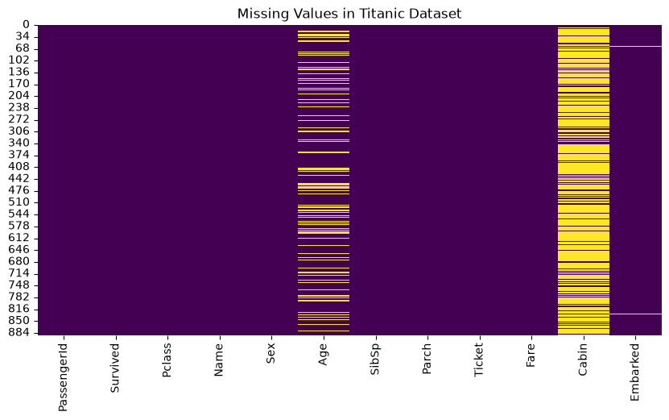 | 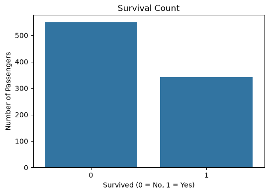 | 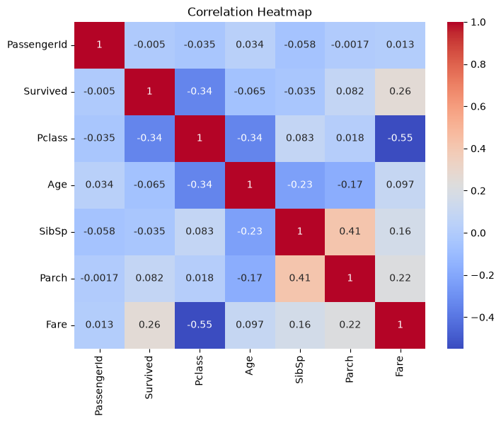 |

---

### 🔹 Week 2: Data Visualization & Data Storytelling
- **Goal**: Derive meaningful data stories by examining univariate, bivariate, and multivariate demographic relationships.
- **Key Insights**:
  1. **Gender Impact**: Female passengers had a dramatically higher survival rate (~74%) compared to male passengers (~19%).
  2. **Class Privilege**: 1st Class passengers experienced higher survival odds (~63%), while 3rd Class passengers suffered the highest mortality (~24% survival rate).
  3. **Demographics**: Children (<10 years old) were prioritized during evacuation.

| Ticket Class Distribution | Survival by Gender | Survival by Ticket Class |
| :---: | :---: | :---: |
| 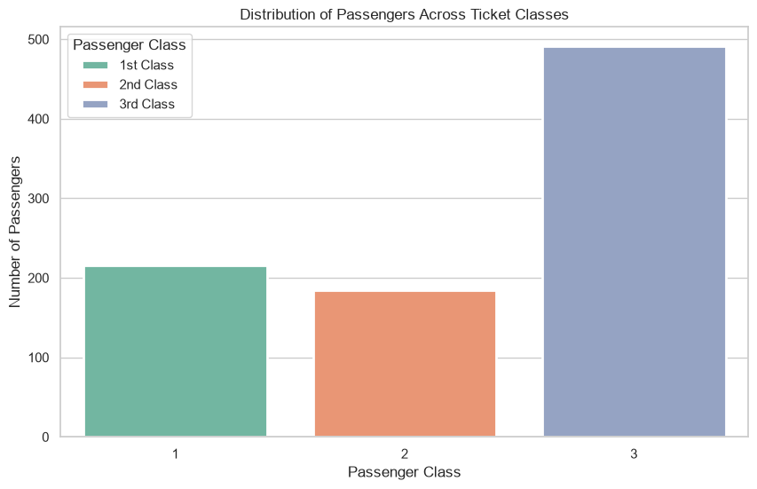 | 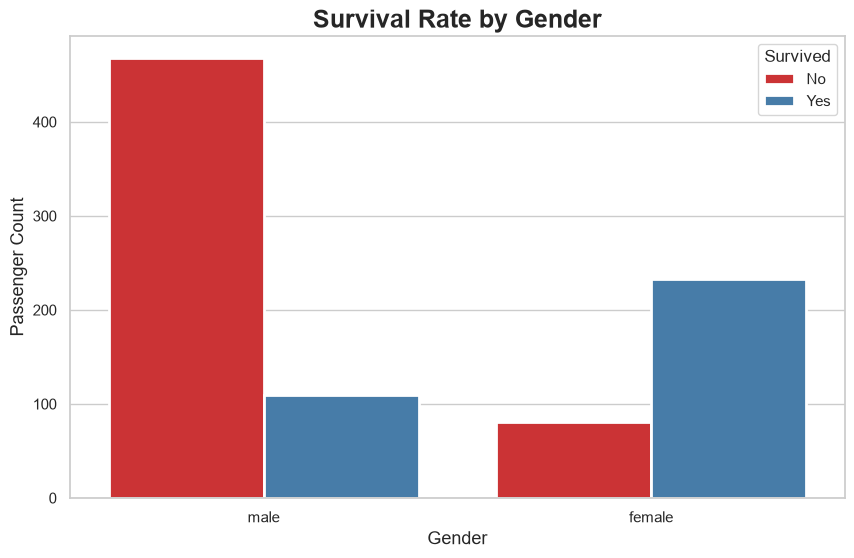 | 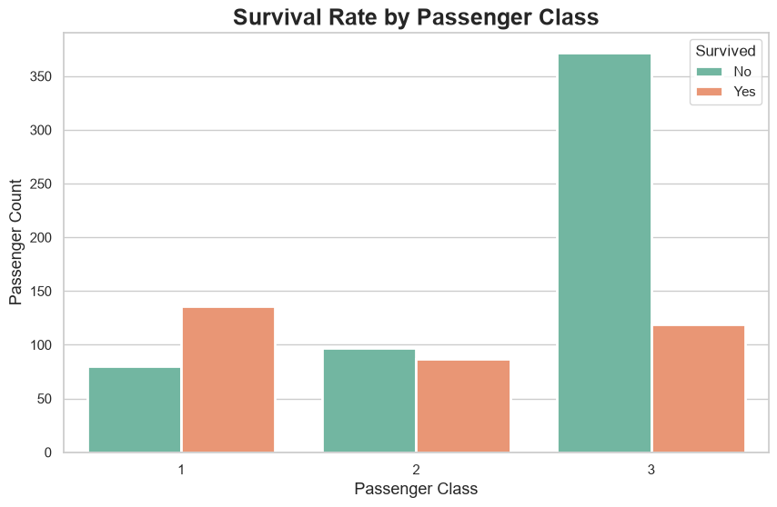 |

| Age Density by Survival Status | Fare Boxplot by Ticket Class |
| :---: | :---: |
| 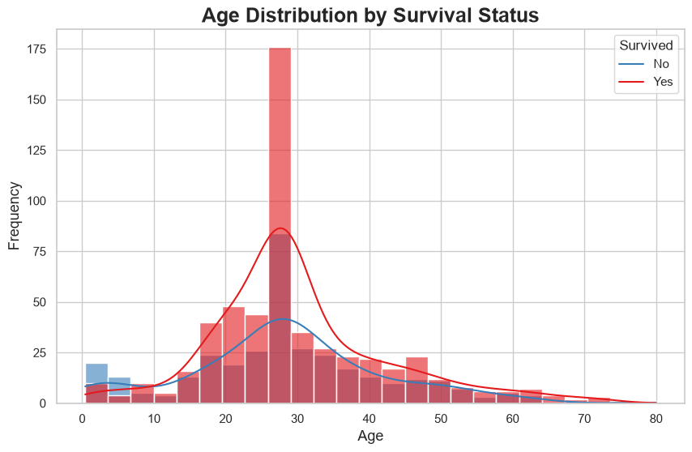 | 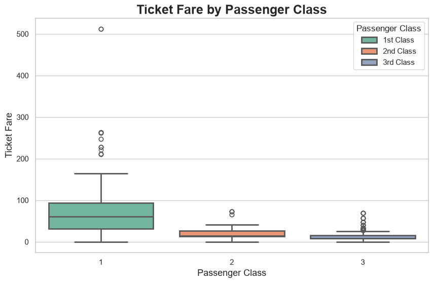 |

---

### 🔹 Week 3: Statistical Hypothesis Testing & Insights
- **Goal**: Rigorously test hypotheses regarding passenger survival using parametric and non-parametric statistical methods in SciPy.
- **Formulated Hypotheses & Results**:
  - **Hypothesis 1 (Gender vs Survival)**: Chi-Square Test of Independence ($\chi^2 = 260.71$, $p < 0.001$). *Result*: Reject $H_0$; Gender significantly impacts survival.
  - **Hypothesis 2 (Pclass vs Survival)**: Chi-Square Test of Independence ($\chi^2 = 102.88$, $p < 0.001$). *Result*: Reject $H_0$; Ticket class strongly influences survival probability.
  - **Hypothesis 3 (Age vs Survival)**: Independent Two-Sample $t$-test ($t = 2.07$, $p = 0.039$). *Result*: Reject $H_0$; Survived passengers were significantly younger on average.

| Hypothesis 1: Gender vs Survival | Hypothesis 2: Pclass vs Survival | Hypothesis 3: Age vs Survival |
| :---: | :---: | :---: |
| 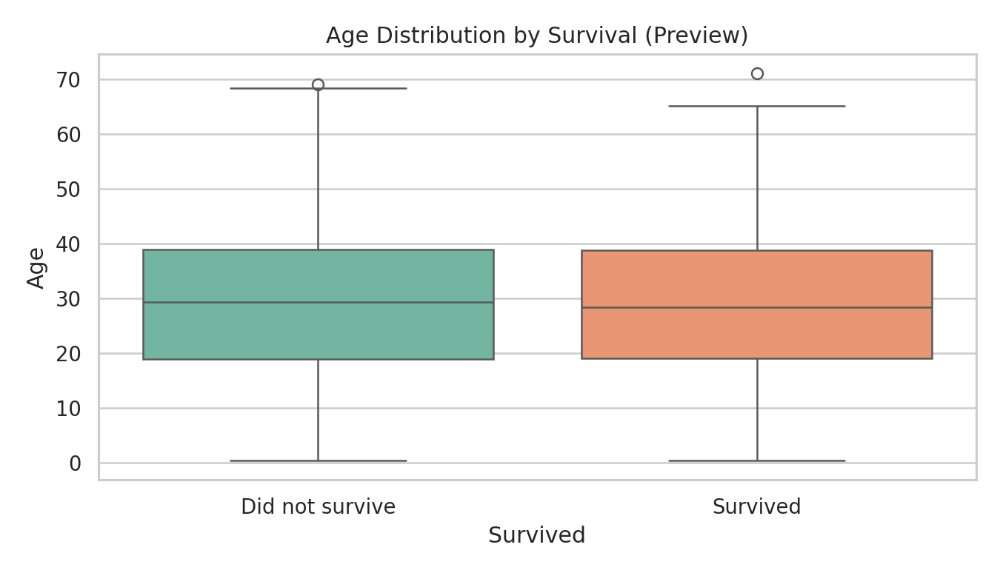 | 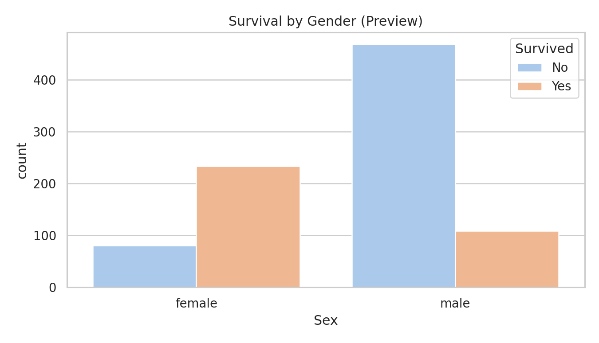 | 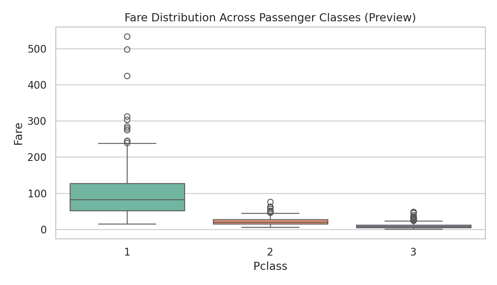 |

---

### 🔹 Week 4: Machine Learning Model Development & Evaluation
- **Goal**: Develop, train, tune, and evaluate binary classification models to predict Titanic passenger survival status (`Survived`: 0 or 1).
- **Models Implemented**: **Logistic Regression** (Linear baseline) and **Decision Tree Classifier** (Non-linear tree model).
- **Key Metrics & Performance Summary**:
  - Logistic Regression achieved robust accuracy (~80%) with strong generalization and high ROC-AUC score (~0.85).
  - Decision Tree captured feature interactions with high training accuracy.

| Target Class Balance | Logistic Regression Confusion Matrix |
| :---: | :---: |
| 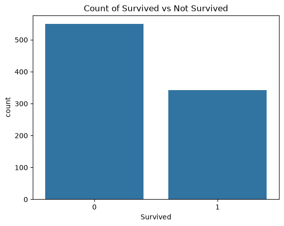 | 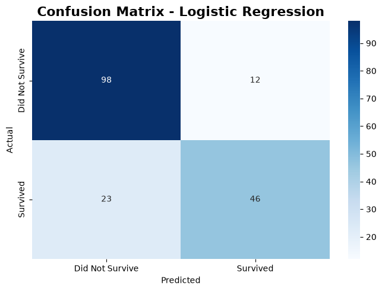 |

| ROC Curve & AUC Score | Model Comparison (LR vs DT) |
| :---: | :---: |
| 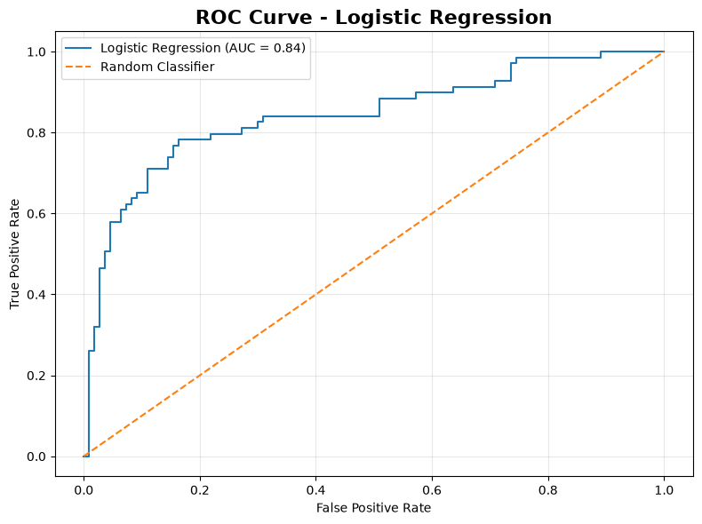 |  |

---

### 🔹 Week 5: End-to-End Pipeline & Comprehensive Final Report
- **Goal**: Synthesize all EDA, data storytelling, statistical validation, and predictive modeling into a cohesive final project documentation report.

| End-to-End Pipeline Summary |
| :---: |
| 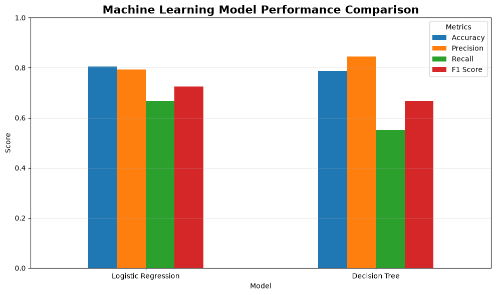 |

---

## ⚙️ Setup & Installation Instructions

1. **Clone the repository:**
   ```bash
   git clone https://github.com/sanketsutar09/Titanic-Data-Science-Pipeline.git
   cd Titanic-Data-Science-Pipeline
   ```

2. **Set up a virtual environment (Recommended):**
   ```bash
   python -m venv .venv
   # Windows:
   .venv\Scripts\activate
   # Linux/macOS:
   source .venv/bin/activate
   ```

3. **Install dependencies:**
   ```bash
   pip install pandas numpy matplotlib seaborn scipy scikit-learn notebook
   ```

4. **Launch Jupyter Notebook to inspect weekly analyses:**
   ```bash
   jupyter notebook
   ```
